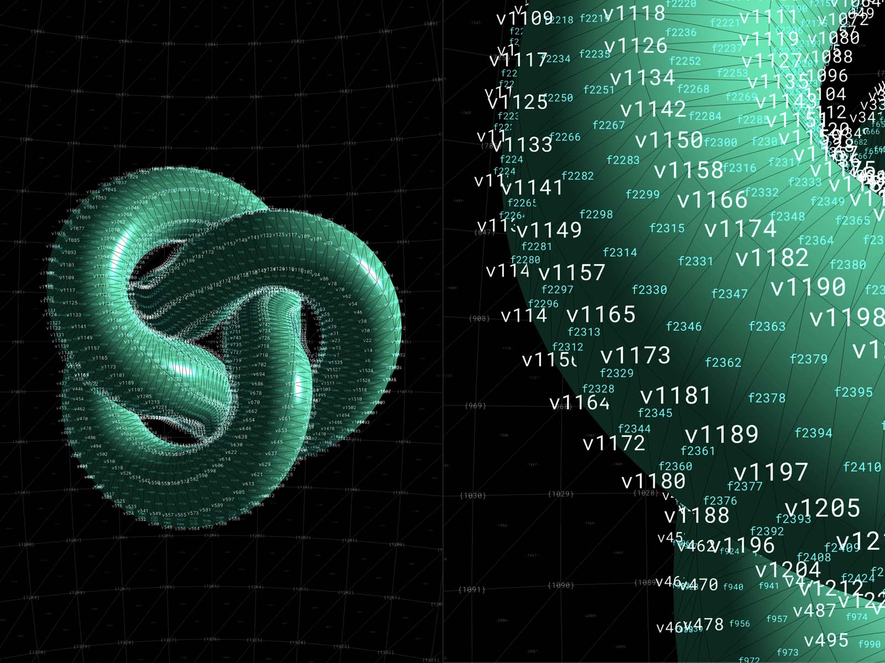

# Point Text Helper
"Point Text" Helper for ThreeJS

<a href="https://jniac.github.io/three-point-text-helper/tests/examples/dist/vertices/">
<p align="center">
  
<p>
<p align="center">
  some texts (position, color, size)
</p>
</a>

<a href="https://jniac.github.io/three-point-text-helper/tests/examples/dist/vertices-stress/">
<p align="center">
  
<p>
<p align="center">
  a lot of texts (37212)
</p>
</a>

<a href="https://jniac.github.io/three-point-text-helper/tests/examples/dist/vertices-knot/">
<p align="center">
  
<p>
<p align="center">
  z_offset (for better readability)
</p>
</a>


## usage
```javascript
import * as THREE from 'three'
import { PointTextHelper } from '@jniac/three-point-text-helper'

//- snip -//

const mesh = new THREE.Mesh(
  new THREE.IcosahedronGeometry(1, 0),
  new THREE.MeshBasicMaterial({ color:'cyan', wireframe:true }),
)
scene.add(mesh)

const pth = new PointTextHelper({ charMax:10 })
mesh.add(pth)

// display some text
pth.display({ text:'hello!',  color:'cyan' })
pth.display({ text:'top',     color:'cyan', size:.5, position:new THREE.Vector3(0, 1, 0) })
pth.display({ text:'bottom',  color:'cyan', size:.5, position:{ x:0, y:-1, z:0 } })

// // display vertices from an array of vertices...
pth.displayVertices(mesh.geometry.vertices)

// or from a buffer (be aware that in buffer geometries vertices are most often duplicated)
const geometry = new THREE.SphereBufferGeometry(1.4, 12, 24)
pth.displayVertices(geometry.getAttribute('position').array, {
  color: '#fc9',
  size: .3,
})
```

## "dev" mode, Run the tests/examples
from the cloned project, 2 process:
- run the library itself + static server
```shell
npm run dev
# (equivalent to)
ts-node extras/dev.ts
```
http://localhost:8000

- [examples](tests/examples)


